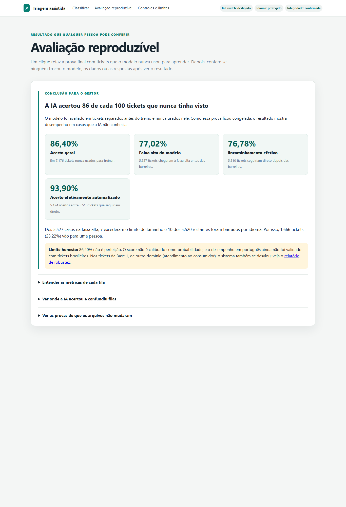

# Submissão — Ramon Baptista — Challenge 002

## Sobre mim

- **Nome:** Ramon Baptista
- **LinkedIn:** https://www.linkedin.com/in/ramon-de-souza-baptista-50674a216/
- **Challenge escolhido:** 002 — Redesign de Suporte

## As três perguntas do diretor de operações

**Onde perdemos tempo?** Os horários não permitem apontar um canal ou tipo como gargalo com segurança.  
Em **49,3% dos tickets fechados, a resolução aparece antes da primeira resposta (1.365 de 2.769; n=2.769)**; o dado claro é que **67,3% seguem sem resolução (5.700 de 8.469; n=8.469)**.  
O primeiro passo é registrar abertura, filas, escalonamentos e esforço ativo.  
[Veja o método e as ressalvas no diagnóstico](solution/diagnostico.md#1-onde-a-operação-trava).

**O que impacta a satisfação?** Nenhum fator testado explica a nota melhor do que o acaso.  
Foram testados **8 fatores (n=2.769; n=1.404 quando entra o tempo)**, sem sinal confiável.  
O primeiro passo é redesenhar a pesquisa e ligar cada resposta aos eventos do atendimento.  
[Veja o método e as ressalvas no plano de medição](solution/proposta-instrumentacao.md).

**Quanto desperdiçamos?** Medimos tempo corrido fora do comum, não desperdício financeiro.  
São **381 ticket-horas além do limite dos 10% mais demorados de cada tipo (n=1.404)**; o benefício bruto fica entre **R$ 16,9 mil e R$ 94,0 mil (n=8.469)**, conforme as premissas do cenário — não é ROI.  
O primeiro passo é medir esforço ativo e todos os custos para calcular o retorno real.  
[Veja o método, as premissas e as ressalvas nos cenários](solution/proposta-instrumentacao.md#estimável-com-premissas-declaradas).

---

## Executive Summary

A base tem falhas que impedem uma comparação segura entre o antes e o depois. O protótipo funciona no domínio em que foi treinado, mas ainda precisa chamar uma pessoa quando há dúvida; quando a barreira detecta idioma não validado, também envia para uma pessoa. A recomendação é arrumar a medição, testar a IA sem autonomia e liberar cada etapa apenas quando ela provar que ajuda.

---

## Solução

A solução une três entregas: um diagnóstico dos dados, um plano prático de medição e um protótipo que classifica tickets sem esconder seus limites.

### Abordagem

Comecei pela pergunta que guia toda a proposta: **como saberemos se a automação melhorou ou piorou o atendimento?** É como receitar um tratamento: primeiro vêm os exames; depois, a intervenção.

As duas bases têm papéis diferentes. A Base 1 mostra problemas da operação de atendimento ao consumidor. A Base 2 ensina e testa o classificador com chamados internos de TI. Elas não foram misturadas, pois falam de assuntos e categorias diferentes.

O trabalho seguiu três regras: conferir a fonte, separar fatos de premissas e manter uma pessoa no controle quando a IA não tiver segurança. Os detalhes estão no [diagnóstico](solution/diagnostico.md), no [plano de medição](solution/proposta-instrumentacao.md) e na [documentação do protótipo](solution/README.md).

| Construído agora | Proposto para o piloto |
|---|---|
| Classificador supervisionado das oito filas da Base 2; faixas técnicas por score; abstenção; barreira de idioma; limite de tamanho; kill switch; avaliação congelada reproduzível; interface web. | Faixas operacionais **A/B/C** por etapa do atendimento; modo sombra; instrumentação de eventos e métricas; LLM para resumir, extrair dados e redigir sugestão sob revisão humana; automação gradual sujeita aos marcos go/no-go. |

As faixas A/B/C e a assistência por LLM descrevem processo futuro: não estão implementadas no protótipo atual.

### Como ver o protótipo

`run.ps1` no Windows e `run.sh` no macOS/Linux abrem a interface no navegador. A opção `--cli` mantém o terminal. Na tela **Classificar**, o avaliador cola um ticket e vê se ele segue direto ou vai para uma pessoa. Em **Avaliação reproduzível**, refaz a prova congelada com um clique. Em **Controles e limites**, confere o kill switch, a proteção de idioma e a integridade dos arquivos.

Mais telas: [direto para a fila](process-log/screenshots/04-tela-classificar-direto-para-fila.png) · [baixa confiança](process-log/screenshots/05-tela-classificar-baixa-confianca-pessoa.png) · [português](process-log/screenshots/06-tela-classificar-portugues-barreira-idioma.png) · [kill switch ligado](process-log/screenshots/09-kill-switch-ligado-tudo-para-pessoa.png).

Demo online no Render: **[LINK DA DEMO]**. O plano gratuito pode levar cerca de **1 minuto (premissa do provedor, não medida nas bases)** para acordar na primeira visita. A publicação será feita pelo Ramon.

### Resultados / Findings

#### 1. Por que o relógio da operação não é confiável

O arquivo tem **8.469 tickets (n=8.469)**, contados por registros completos porque as descrições ocupam várias linhas. O confronto direto dos horários mostra a solução antes da primeira resposta em **1.365 dos 2.769 fechados — 49,3% (n=2.769)**; sobram **1.404 casos em ordem cronológica (n=1.404)**, mas nem eles têm o horário de abertura. A auditoria também encontrou o mesmo placeholder em **100% das descrições (n=8.469)** e e-mails `example.*` em **100% dos registros (n=8.469)**, por busca literal e sem premissa externa. Por isso, esses horários não sustentam um ranking de gargalos; o [diagnóstico completo](solution/diagnostico.md) documenta método e limites.

#### 2. A satisfação existe como coluna, mas não como métrica confiável

O resultado executivo e o método estão em [“O que impacta a satisfação?”](#as-três-perguntas-do-diretor-de-operações). O detalhe importante é o limite: ausência de associação confiável nesta base não prova efeito zero; por isso, a recomendação é redesenhar a medição antes de escolher uma alavanca.

#### 3. O protótipo funciona em inglês e sabe quando deve parar

O classificador lê o texto e sugere uma das categorias da Base 2. No conjunto que ficou guardado apenas para a prova final, ele teve **86,4% de acerto (6.200 acertos em n=7.176)**; escolher sempre a categoria mais comum teria **28,5% (2.043 acertos em n=7.176)**. O método foi comparar as previsões com as respostas corretas em casos nunca usados nos ajustes; ele é adequado porque simula novos tickets. Não houve premissa externa. A matriz por categoria, as fórmulas e todas as conferências estão em [`model_evaluation.md`](solution/outputs/model_evaluation.md).

| Quando o modelo... | O que acontece |
|---|---|
| reconhece um caso com força | sugere a fila e registra a decisão |
| fica em dúvida | uma pessoa aprova ou corrige |
| tem idioma não validado detectado pela barreira, sinal fraco ou arquivo alterado | chama uma pessoa |

No teste de idioma, os mesmos **800 casos (n=800)** foram avaliados em inglês e em tradução para português. O resultado equilibrado entre categorias caiu de **85,7% para 41,5%**. O método usa os mesmos casos nos dois idiomas para isolar a mudança de língua; a premissa é que a tradução automática se aproxima do português real, mas ela veio em variante europeia e não representa clientes brasileiros. Por isso, o número serve para revelar risco, não para prometer desempenho no Brasil.

Quando a barreira detecta idioma não validado, envia o ticket para uma pessoa; ela não é infalível. Na validação, **14 de 812 textos em português não foram detectados (n=812 PT)**. Método: contagem exata de PT→fluxo normal no conjunto de validação; fundamento: mede diretamente a falha de escape da barreira. Premissas: os rótulos de idioma estão corretos e a amostra traduzida não representa a prevalência operacional.

Também foi testado o Jev nesses mesmos **800 casos (n=800)**. Ele ficou em **38,6% em inglês e 36,8% em português traduzido**. O método manteve a mesma amostra para uma comparação justa; a premissa de idioma é a mesma do teste anterior. Como ele não aceitou aprender com a base do cliente e não separou bem acerto de erro, não foi escolhido para esta etapa. O estudo completo está no [diagnóstico de idioma](solution/outputs/language_root_cause/diagnostico_causa_raiz.md).

Fora desse domínio, o comportamento muda. Nos tickets da Base 1, de outro domínio (atendimento ao consumidor) e com assuntos diferentes dos usados no treino, **2.718/8.469 = 32,1% iriam direto (n=8.469)**. O método removeu literalmente o placeholder `{product_purchased}` e aplicou o serviço completo; ele mede exposição em outro domínio, não acurácia, pois as taxonomias não são compatíveis. Não houve premissa externa além de tratar cada ticket como observação independente.

Os sintéticos confirmam o alerta, mas são apenas complemento exploratório. Entre os casos encaminhados, o erro foi de **39,6% a 60,7%** nas reformulações, digitação e textos curtos (**n=53, n=64 e n=56 encaminhados**), contra **340/5.527 = 6,15% no teste oficial (n=5.527)**. O método foi `errados ÷ encaminhados`, com intervalo de Wilson; ele compara o risco onde haveria automação. A premissa é que os textos foram gerados por IA. Como cada grupo sintético tem **n<100**, os resultados não viram recomendação isolada. O detalhe está no [relatório de robustez](solution/outputs/robustez/relatorio.md).

A barreira experimental de “fora do escopo” também foi levada à Base 1 sem ajuste. Ela reduziu os envios diretos em apenas **67/2.718 = 2,5% (n=2.718)**. O método comparou o mesmo serviço antes e depois dos cinco padrões congelados; isso é adequado para testar generalização sem recalibrar olhando a prova. A barreira não generalizou e ficou **desligada**. É uma decisão de produto: uma proteção estreita não deve criar aparência de segurança.

Conclusão: o modelo é bom no domínio em que foi treinado e se desvia fora dele. Por isso, a proposta começa em modo sombra, mede tickets da operação e só automatiza depois da aprovação nos [critérios go/no-go](solution/proposta-instrumentacao.md#5-marcos-que-autorizam-automatizar).

#### 4. Onde entra LLM e onde não

**LLM para compreensão e assistência; modelo supervisionado para classificação; regras para decisões determinísticas; humano para risco e julgamento.**

Imagine um ticket chegando. Primeiro, regras fixas verificam idioma, modo de segurança e sinais conhecidos de fora do escopo. Depois, o TF-IDF escolhe uma das oito filas. Se houver risco ou ambiguidade, uma pessoa assume. Uma LLM pode preparar o caso para essa pessoa, mas não decide a fila nem executa uma ação sem volta.

| Etapa | Ferramenta | Por quê | Evidência |
|---|---|---|---|
| Classificar e escolher a fila | TF-IDF + classificador supervisionado | Aprendeu diretamente com os rótulos da Base 2 e pode ser reavaliado no teste congelado. O score é uma probabilidade máxima **não calibrada**; hoje ele ordena força relativa, não mede chance real de acerto. | **Acurácia de 86,40% (6.200/7.176; n=7.176); macro-F1 de 86,51% (n=7.176)** na avaliação publicada. Método: acertos divididos pelos casos rotulados para acurácia e média simples do F1 das oito classes para macro-F1; fundamento: teste separado do ajuste e peso igual entre classes no macro-F1. Sem premissa externa. O Jev, uma LLM, teve **38,6% em inglês (n=800)**. Como as amostras têm tamanhos diferentes, a comparação é descritiva, não um teste pareado. |
| Proteger idioma e desligar a automação | Regras fixas | Essas decisões precisam repetir exatamente o mesmo comportamento. A barreira experimental de “fora do escopo” não generalizou na Base 1 e ficou desligada. | Sem a barreira, **2.718/8.469 = 32,1% (n=8.469)** da Base 1 iriam direto; com ela, **2.651/8.469 = 31,3% (n=8.469)**. Método: comparação antes/depois no mesmo conjunto; fundamento: mede exposição, não acurácia. Sem premissa externa além da independência dos tickets. |
| Resumir, extrair dados e redigir resposta sugerida | LLM assistida, proposta e ainda não construída | Ajuda a pessoa a entender e responder mais rápido, sem substituir a decisão. Toda saída passa por revisão humana. Para ticket em português, a proposta é usar a LLM junto com embeddings multilíngues e validá-los em português brasileiro real antes de uso. | O teste de idioma mostrou queda do TF-IDF traduzido; o Jev não superou a triagem. Portanto, uso assistido é mais seguro que autonomia. Não há medição de qualidade dessa assistência nesta entrega. |
| Segurança, fraude, jurídico, financeiro, casos ambíguos e ações irreversíveis | Humano obrigatório | Erro pode causar dano difícil de reverter e exige contexto, responsabilidade e julgamento. | Regra de governança proposta. É uma premissa de risco, não um resultado das bases. A robustez reforça o cuidado: na Base 1, de outro domínio, o sistema mandaria **2.718/8.469 = 32,1% (n=8.469)** direto após remover o placeholder; método e fundamento estão no relatório. |

A barreira de “fora do escopo” foi calibrada em uma metade sintética e medida na outra. No teste congelado, sua ativação reduziria a cobertura automática de **5.510/7.176 = 76,8%** para **5.460/7.176 = 76,1%**, custo de **50 casos e 0,7 ponto percentual (n=7.176)**. Método: mesma regra aplicada sem ajuste ao teste congelado; fundamento: medir o custo fora da calibração. Como bloqueou apenas **67/2.718 = 2,5% (n=2.718)** dos envios diretos na Base 1, não generalizou. A decisão foi mantê-la atrás de `TICKET_CLASSIFIER_ROBUSTNESS_GUARD` e **desligada por padrão**.

#### 5. O ganho financeiro ainda é um cenário, não um ROI

O resultado executivo está em [“Quanto desperdiçamos?”](#as-três-perguntas-do-diretor-de-operações). A memória de cálculo, as premissas de cada cenário e a sensibilidade ficam no [plano de medição](solution/proposta-instrumentacao.md#estimável-com-premissas-declaradas); benefício bruto não é ROI.

### Recomendações

| O que fazer | Por quê | Primeiro passo concreto |
|---|---|---|
| Arrumar os registros | Sem horários confiáveis, não há comparação segura. | Operações e Dados mapeiam eventos e responsáveis em **uma semana** — prazo proposto para gerar uma lista rápida de correções, não calculado pelas bases. |
| Redesenhar as pesquisas | A nota atual não mostra o que melhora a experiência. | Experiência do Cliente define perguntas e momento de envio em **duas semanas** — premissa para um ciclo curto de trabalho, não calculada pelas bases. |
| Rodar a IA sem contato com o cliente | A empresa mede erros sem expor ninguém. | Suporte e Dados ativam o modo sombra por **quatro semanas** — premissa para observar variações semanais; a decisão segue humana. |
| Liberar tarefas, não cargos | Triagem pode avançar antes; fraude, segurança, jurídico e ações sem volta continuam humanos. | Operações e Risco classificam cada etapa em **duas semanas** — premissa de planejamento, não achado das bases. |
| Coletar português real e custos | Sem dados brasileiros e custo total, não há promessa de qualidade nem ROI. | Dados inicia a coleta agora; Finanças levanta custos em **uma semana** — premissa para revisar cedo o cenário. |

### Limitações

- A Base 1 tem sinais de conteúdo sintético e não permite medir o ciclo completo do atendimento.
- A Base 2 trata de suporte interno de TI; seu resultado não prova desempenho no atendimento ao consumidor.
- O português foi traduzido automaticamente e não substitui tickets escritos por brasileiros.
- O cenário financeiro mostra benefício bruto sob premissas. Não mede economia realizada nem ROI.
- O protótipo foi validado no Windows (instalação do zero e recuperação de ambiente quebrado) e no Linux, pelo Google Colab, onde a avaliação reproduziu exatamente a mesma matriz de confusão ([ver print](process-log/screenshots/02-teste-linux-colab-passou.jpeg)). Depois da interface web, o teste no Colab foi repetido: instalação do zero, reprodução da avaliação e 20 de 20 testes aprovados, incluindo os da interface ([ver print](process-log/screenshots/03-teste-linux-colab-interface-20-testes.png)). O macOS usa o mesmo `run.sh` do Linux, mas não foi testado numa máquina Mac.

---

## Process Log — Como usei IA

### Ferramentas usadas

| Ferramenta | Papel |
|---|---|
| Codex (modelo GPT-5.6 sol) | Executor: analisou dados e construiu o protótipo. |
| Claude Code (modelo Claude Opus) | Revisor: questionou métodos e conclusões. |
| Supabase/Postgres | Conferência independente dos dados brutos com SQL. |
| Ramon Baptista | Auditor: definiu testes e aprovou recomendações. |

### Workflow

1. Dei o desafio ao Codex com pouco contexto para observar seus erros.
2. Impedi apenas a mistura das bases.
3. Conferi as afirmações no dado bruto com SQL.
4. Usei o Claude Code para revisar o método e confrontar o Codex.
5. Transformei dúvidas em testes e defini limites humanos.
6. Registrei regras permanentes para as próximas execuções.

### Onde a IA errou e como corrigi

- O Claude Code percebeu que as categorias não combinavam; o Codex recusou o cruzamento; eu barrei a fusão.
- O Claude Code contou linhas como tickets. O Codex corrigiu o total, e eu conferi no banco.
- O Claude Code apontou um ranking apoiado em **15 casos (n=15)**. O método de revisão foi conferir o tamanho do grupo; como a regra exige pelo menos **30 observações** para conclusão executiva, o cruzamento de três fatores ficou apenas histórico/exploratório e o diagnóstico passou a agregar canal × tipo, com **n≥30**.
- O Claude Code mostrou que chamar todo tempo acima da mediana de “desperdício” criava desperdício até numa operação perfeita. A métrica foi retirada.
- O Claude Code desconfiou da confiança máxima do Jev em **5 frases (n=5)**. Pela premissa mínima de **30 observações**, o teste era apenas exploratório; o Codex então desenhou a avaliação maior.
- O Claude Code viu que o protótipo reaproveitava pacotes do computador. O instalador foi isolado e preparado para se recuperar de falhas.

### O que eu adicionei que a IA sozinha não faria

1. **Escolhi os papéis.** “Eu quero que eu seja o auditor, você seja o meu guia e o GPT seja a IA escolhida [...] com baixo raciocínio.” Quis enxergar onde o controle humano fazia diferença.
2. **Testei a IA sem contexto.** “O objetivo é descobrir como uma IA sem o contexto [...] executaria essa tarefa, para que eu possa corrigi-la.” Usei intenção, informação e instrução nos prompts.
3. **Deixei os erros aparecerem.** Barrei somente a fusão das bases e observei o restante antes de interferir.
4. **Voltei à fonte.** “Não quero ver os outputs que o GPT gerou, quero ver [...] a fonte original.” Subi as bases no banco e pedi “SQL para conferir e provar”.
5. **Contestei as datas antes de rejeitá-las.** “E se [...] resolveu antes mesmo de o suporte conseguir responder?” A hipótese foi testada e caiu; a pergunta evitou uma conclusão apressada.
6. **Transformei o problema da satisfação em ação.** “Precisamos otimizar ou redesenhar os processos de pesquisa de satisfação para ter dados que realmente reflitam o que mais importa para o cliente.”
7. **Cobrei uma proposta completa.** “Faltou [...] definir quais processos serão automatizados, quais terão um colaborador com agentes de IA [...] e quais continuarão humanos”, além dos benefícios.
8. **Defini a tese central.** “Precisaremos implementar processos de medição antes mesmo de sair automatizando.” Sem os exames, não sabemos se o tratamento ajudou.
9. **Transformei cuidado em regra.** “Quanto melhor o input, melhor o output.” Passei a exigir método, premissas, fundamento, amostra e abertura dos cálculos.
10. **Testei o produto pessoalmente.** Ao digitar em português, concluí: “Estamos no Brasil, o sistema deve ser capaz de entender tudo em português!”
11. **Defendi o leitor leigo.** “O avaliador é uma pessoa não técnica.” A saída passou a usar linguagem de negócio.
12. **Questionei o Jev.** Como havia relatos positivos, pedi para rever a configuração e descobrir se ele aprenderia com dados do cliente. A resposta revelou uma limitação do produto.
13. **Exigi a causa.** “Precisamos entender a causa raiz” do português. O Codex mostrou que o modelo aprendeu palavras em inglês e quase não reconhecia as traduzidas.
14. **Auditei o próprio README.** Cortei o excesso técnico, simplifiquei a linguagem e devolvi os julgamentos humanos aos seus autores.

---

## Evidências

- [x] [Conversa organizada com o executor](process-log/chat-exports/CONVERSA-COMPLETA-GPT.md)
- [x] [Auditorias por etapa](process-log/auditorias/)
- [x] [Conferência independente em SQL](solution/scripts/00_verificacao_auditoria.sql)
- [x] [Avaliação completa do modelo](solution/outputs/model_evaluation.md)
- [x] [Diagnóstico do idioma](solution/outputs/language_root_cause/diagnostico_causa_raiz.md)
- [x] [Código e instruções do protótipo](solution/README.md)
- [x] Screenshots do produto: [ticket que segue direto](process-log/screenshots/04-tela-classificar-direto-para-fila.png), [baixa confiança → pessoa](process-log/screenshots/05-tela-classificar-baixa-confianca-pessoa.png), [português → barreira de idioma](process-log/screenshots/06-tela-classificar-portugues-barreira-idioma.png), [avaliação reproduzível](process-log/screenshots/07-tela-avaliacao-reproduzivel.png), [controles e limites](process-log/screenshots/08-tela-controles-e-limites.png) e [kill switch ligado → tudo para pessoas](process-log/screenshots/09-kill-switch-ligado-tudo-para-pessoa.png).
- [x] Screenshots do processo: [`process-log/screenshots/`](process-log/screenshots/) — por exemplo, o momento em que pedi o README em texto editável para reescrever com as minhas palavras ([ver print](process-log/screenshots/01-pedido-readme-editavel.jpeg))
- [ ] Screen recording: não utilizado
- [x] Git history: o PR está organizado em commits por camada da entrega (escopo, diagnóstico, protótipo, avaliação, process log e README), todos feitos no dia do envio. O trabalho não foi versionado ao longo do caminho; a evolução real está registrada no process log.
- [x] Outro: o protótipo roda na máquina do avaliador com um comando (`run.ps1` no Windows, `run.sh` no macOS/Linux), no Google Colab ou pela demo no Render após a publicação do Ramon: **[LINK DA DEMO]**

---

_Submissão enviada em: 24/09/2026_
